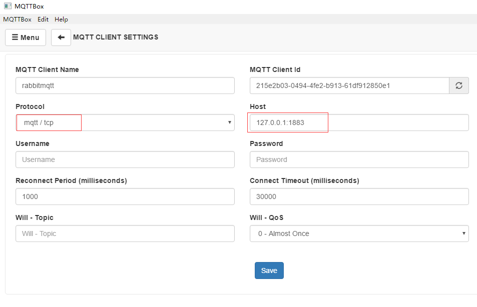
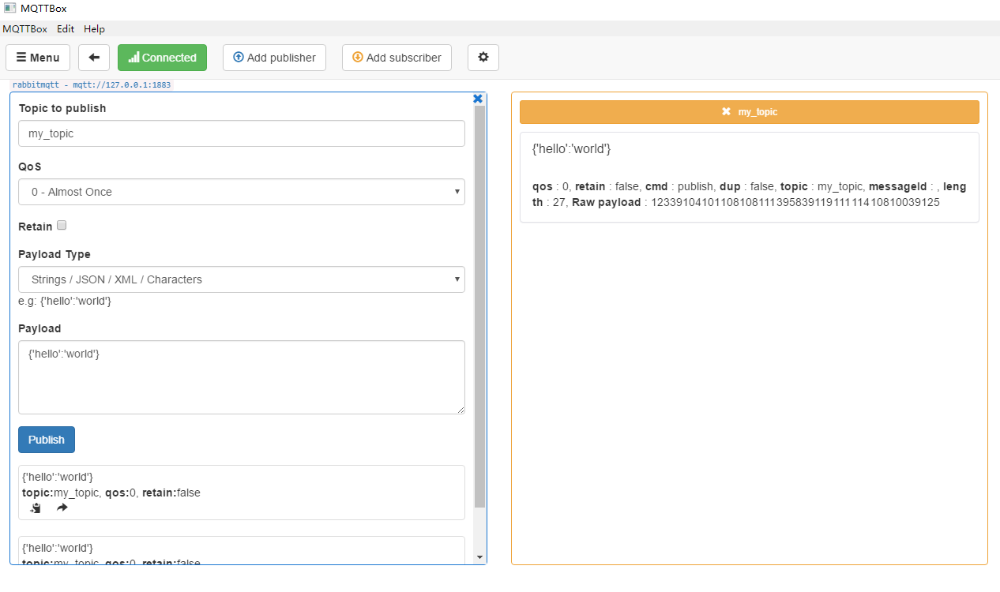

### springboot2-rabbitmq
springboot2整合rabbitmq 里面有常用的三种模式【广播模式fanout，路由模式redirect, 匹配模式topic】

### 运行前的准备条件
>	管理后台的安装：
 	1.先安装erlang 下载地址【http://www.erlang.org/downloads】 ,配置环境变量 
 	2.下载并安装RabbitMQ【可以下载window二进制文件，解压就可以用了】
 	启动后台管理：
 	1.先安装后台管理界面——>进入sbin目录——>执行【rabbitmq-plugins enable rabbitmq_management】安装管理后台——>再启动服务【rabbitmq-server.bat】
 	2.访问【localhost:15672】[账号：guest 密码：guest]
### 相关插件的集成
#### mqtt集成
>`先参考官网：` [https://www.rabbitmq.com/mqtt.html](https://www.rabbitmq.com/mqtt.html)

```$xslt
# 执行开启mqtt
rabbitmq-plugins enable rabbitmq_mqtt
```
- 效果
>



#### websocket集成
>`先参考官网：` [https://www.rabbitmq.com/web-mqtt.html](https://www.rabbitmq.com/web-mqtt.html)